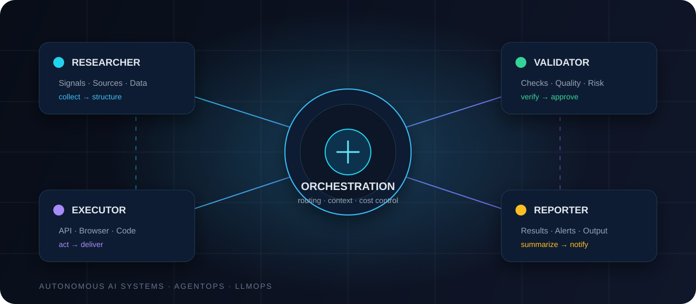

<div align="center">
  
</div>

# IM — Autonomous AI Systems & Digital Automation

**AI Systems Engineer · Autonomous AI Agents · Multi-Agent Orchestration · LLMOps · AgentOps**

[**Contact & collaboration**](#contact) · [**Choose a language**](#languages)

---

> I design and launch autonomous AI-agent systems that turn complex workflows into controlled, cost-optimized, 24/7 automation pipelines.

## ✦ Core expertise

| Area | What I build |
| --- | --- |
| **Autonomous agents** | Production agent systems and specialized agent swarms |
| **Multi-agent orchestration** | Role-based workflows: research, analysis, code, validation, execution and reporting |
| **LLMOps / AgentOps** | Reliable 24/7 execution, queues, monitoring, retry/fallback logic and human-in-the-loop controls |
| **Cost optimization** | Model routing, prompt compression, caching, context control and structured outputs |
| **Local LLMs** | Llama, Mistral, Qwen and hybrid cloud + local pipelines |

## ⚙️ How systems are delivered

```text
Collect → Analyze → Plan → Execute → Validate → Deliver
```

Agents work with APIs, browsers, documents, Telegram, databases, servers and custom services. The goal is not “AI for AI’s sake,” but dependable systems that reduce manual work, accelerate operations and control LLM cost at scale.

## 🧩 Typical capabilities

- Autonomous data collection and processing from websites, Telegram, APIs, documents, spreadsheets, email and information streams.
- Web research, source monitoring, entity extraction, classification, comparison and reporting.
- Code generation, execution and validation for automation.
- Browser, WebSocket, CRM, Telegram Bot API, file, database and backend-service workflows.
- Rule-based, LLM-evaluated and hybrid automated decisions.
- OSINT and information monitoring across news, signals, narratives, actors and events.

## 🛠️ Stack

`Claude API` · `GPT-4` · `OpenAI-compatible API` · `Local LLMs` · `Llama` · `Mistral` · `Qwen` · `Python` · `Node.js` · `WebSocket` · `REST API` · `Telegram Bot API` · `Browser automation` · `SQLite` · `Qdrant` · `Vector search` · `Knowledge graphs` · `Dedicated servers` · `VM / emulators` · `GitHub` · `Cursor` · `ZennoPoster`

## 🌍 Languages

| | | |
| --- | --- | --- |
| 🇺🇦 [Українська](docs/uk.md) | 🇷🇺 [Русский](docs/ru.md) | 🇬🇧 [English](docs/en.md) |
| 🇨🇳 [中文（简体）](docs/zh-CN.md) | 🇩🇪 [Deutsch](docs/de.md) | 🇫🇷 [Français](docs/fr.md) |
| 🇪🇸 [Español](docs/es.md) | 🇧🇷 [Português (Brasil)](docs/pt-BR.md) | 🇯🇵 [日本語](docs/ja.md) |
| 🇸🇦 [العربية](docs/ar.md) |  |  |

## 📬 Contact

| Channel | Details |
| --- | --- |
| **Email** | [BotsLab@proton.me](mailto:BotsLab@proton.me) |
| **Telegram** | [@TheBotsLab](https://t.me/TheBotsLab) |

**Available for:** consulting · project collaboration · remote full-time roles.

---

<sub>Public professional profile only. It never contains credentials, private keys, customer data, internal infrastructure, unreleased product materials or sensitive NeuroMedia information. Only explicitly approved standalone products are published in separate repositories.</sub>
