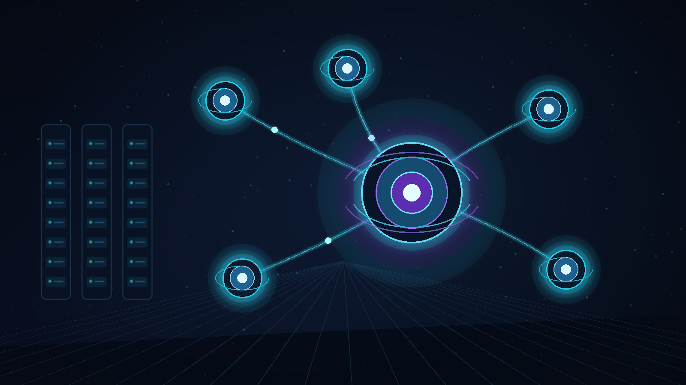

<div align="center">
  
</div>

# GeniusBotsLab — AI Automation, Software Delivery & Video Workflows

**AI Automation Engineer · AI-assisted Developer · AI Video Workflow Builder**

I build practical, human-reviewed AI workflows for automation, software delivery and video production. My work focuses on useful systems: clear inputs, controlled tool use, validation, documented limits and deliverables people can actually use.

[**Portfolio**](#selected-public-work) · [**How I work**](#how-i-work) · [**Contact**](#contact)
[English](en.md) · [Русский](ru.md) · [Română](ro.md) · [简体中文](zh-CN.md) · [עברית](he.md) · [Français](fr.md) · [Deutsch](de.md) · [Español](es.md) · [Português (Brasil)](pt-BR.md) · [日本語](ja.md) · [العربية](ar.md) · [Українська](uk.md)

---

## What I build

- **AI automation & agent workflows** — research, document and API workflows with defined inputs, structured outputs, review steps and delivery paths.
- **AI-assisted software delivery** — prototype, improve and document software using Claude, Claude Code, ChatGPT and Cursor; final changes are manually reviewed and validated.
- **AI video workflows** — turn a brief into a concept, script, generated scene options, human-led edit, captions and delivery versions for short-form or standard video.
- **LLMOps / AgentOps foundations** — model routing, context control, retries, fallback paths, logs, budgets and human approval where the action is consequential.

## Selected public work

These public repositories are the currently verifiable part of the portfolio. They contain standalone, publishable work only — never client data, credentials or private infrastructure.

- [**Swarm Agent Coordinator**](https://github.com/GeniusBotsLab/swarm-agent-coordinator) — self-hosted coordination server for agent teams, rooms, tasks and master control.
- [**TextFix**](https://github.com/GeniusBotsLab/textfix) — Windows hotkey utility for AI-assisted typo correction through an OpenAI-compatible API.
- [**Self-Correcting Link Parser**](https://github.com/GeniusBotsLab/self-correcting-link-parser) — compliant public-link collection, normalization and quality-control workflow.
- [**ZennoPoster YouTube Automation Course**](https://github.com/GeniusBotsLab/zennoposter-youtube-automation-course) — compliant YouTube workflow, video SEO and content-operations material.

## AI-assisted engineering workflow

I use AI tools as part of an engineering process, not as a substitute for responsibility:

- **Claude & ChatGPT:** research, structured drafting, specifications, content variants and working notes; facts, sources and final fit are checked before delivery.
- **Claude Code & Cursor:** repository exploration, task decomposition, draft changes, refactoring, test scenarios and documentation; final code is reviewed and tested manually.
- **Video tools & editing software:** concept and scene exploration, selection of usable takes, editing, captions, sound and final QC. AI-generated material is clearly labelled when published.

## How I work

```text
Brief → Research → Design → Build → Validate → Human review → Deliver
```

I design workflows with clear boundaries: what is automated, what requires approval, which data can be used, how failures are handled and how results are checked. Production claims and numeric results are only published where they can be supported by a public artefact or an approved, anonymized case study.

## Stack

**AI & development:** Claude · Claude Code · ChatGPT · Cursor · OpenAI-compatible APIs · Python · Node.js
**Automation & integration:** REST APIs · WebSocket · Telegram Bot API · browser automation · workflow design
**Data & operations:** SQLite · Qdrant · vector search · queues · logging · dedicated servers · VM/emulators
**Media:** AI-assisted video concepts · scene generation · editing · captions · short-form delivery

## Languages

Portfolio documentation is available in:
[English](en.md) · [Русский](ru.md) · [简体中文](zh-CN.md) · [עברית](he.md) · [Français](fr.md) · [Deutsch](de.md) · [Español](es.md) · [Português (Brasil)](pt-BR.md) · [日本語](ja.md) · [العربية](ar.md) · [Українська](uk.md)

English is the international reference version. Translations preserve the same public facts and links; technical names and repository titles remain in their original form.

## Contact

- **Email:** [BotsLab@proton.me](mailto:BotsLab@proton.me)
- **Telegram:** [@TheBotsLab](https://t.me/TheBotsLab)

**Open to:** remote AI Engineering / AI Automation roles and selected project collaborations.

---

<sub>Public professional portfolio only. It contains no credentials, private keys, customer data, internal infrastructure or unpublished NeuroMedia materials. AI-assisted work is disclosed at the workflow level; final responsibility, review and quality control remain human-led.</sub>
